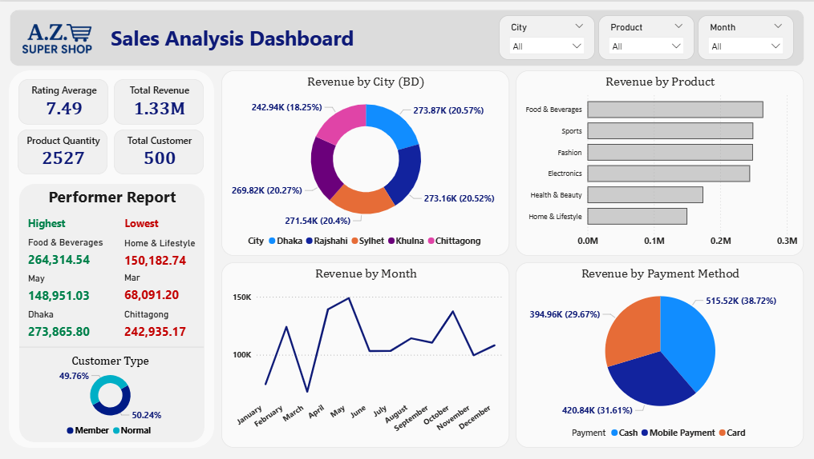

# 🛒 A.Z. Super Shop – Sales Analysis Dashboard

An interactive Power BI dashboard analyzing the sales performance of a retail store — **A.Z. Super Shop**.  The dashboard provides insights into product revenue, city performance, customer types, and monthly trends.

---

## 🎯 Objective
To visualize and analyze sales data for better business decision-making and identify the top-performing products, cities, and months.

---

## 🧰 Tools & Technologies
- **Microsoft Power BI**
- **Microsoft Excel**
- **Power Query Editor**
- **DAX (Data Analysis Expressions)**

---

## 🧹 Data Preparation
- Cleaned and transformed raw sales data.
- Removed duplicates and null values.
- Created calculated columns.

---

## 📈 Key Insights
| Metric | Value |
|--------|--------|
| Total Revenue | 1.33M |
| Rating Average | 7.49 |
| Total Products Sold | 2527 |
| Total Customers | 500 |
| Top Product | Food & Beverages (264K) |
| Top City | Dhaka (273K) |
| Highest Revenue Month | May (148K) |

---

## 📊 Dashboard Highlights
- **KPI Cards:** Total Revenue, Rating Average, Product Quantity, Total Customers  
- **Visuals:**
  - Donut Chart – Revenue by City
  - Bar Chart – Revenue by Product
  - Line Chart – Revenue by Month
  - Pie Chart – Payment Method Analysis
- **Filters:** City, Product, Month
- **Performer Report:** Displays top & bottom product categories and cities
- **Customer Type Distribution:** Member vs. Normal

---
